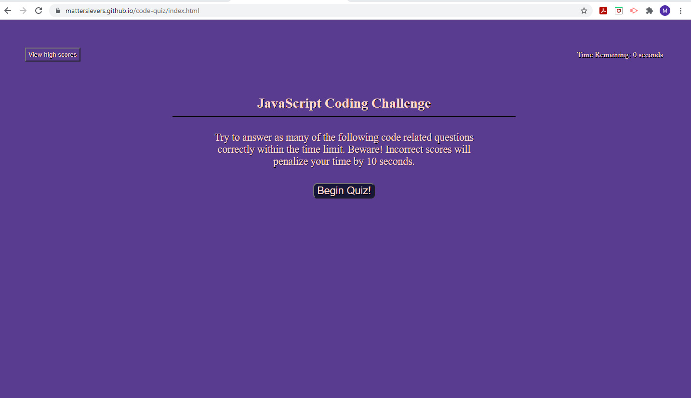

# JavaScript Coding Challenge

### This program uses HTML, CSS, and JavaScript to generate DOM elements for a dynamic quiz over the JavaScript language. The challenge is outlined as follows: 

 
- The quiz starts with a 75 second timer. 
- The quiz currently consists of 10 questions.
- Each incorrect response will result in a 10 second deduction from the timer. 
- Each correct solution will increase the player's score by one point.

[Click here to undertake the challenge!](http://mattersievers.github.io/code-quiz/)

